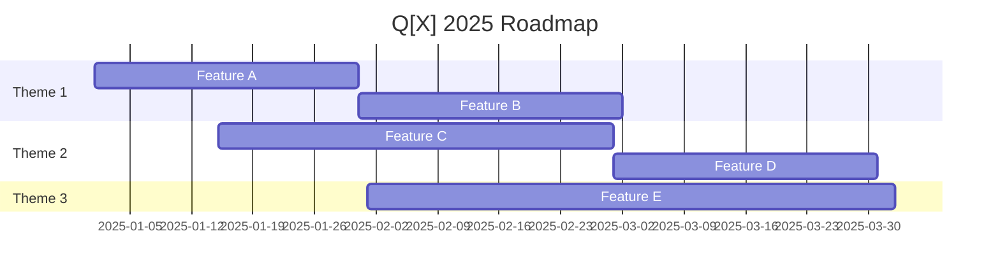

# [Product Area] Roadmap - [Quarter/Year]

**Last Updated**: YYYY-MM-DD  
**Product Owner**: [Name]  
**Engineering Lead**: [Name]

## Vision

[1-2 sentences describing the long-term vision for this product area]

## Q[X] 2025 Themes

1. **[Theme 1]**: [Brief description]
2. **[Theme 2]**: [Brief description]
3. **[Theme 3]**: [Brief description]

## Roadmap Overview

## Detailed Features

### 🎯 Feature A: [Name]
**Priority**: P0 | P1 | P2  
**Effort**: S | M | L | XL  
**Target Date**: YYYY-MM-DD

**Description**: [What we're building and why]

**Success Criteria**:
- [ ] [Criterion 1]
- [ ] [Criterion 2]

**Dependencies**:
- [Dependency 1]
- [Dependency 2]

---

### 🎯 Feature B: [Name]
**Priority**: P0 | P1 | P2  
**Effort**: S | M | L | XL  
**Target Date**: YYYY-MM-DD

**Description**: [What we're building and why]

**Success Criteria**:
- [ ] [Criterion 1]
- [ ] [Criterion 2]

**Dependencies**:
- [Dependency 1]
- [Dependency 2]

## Metrics & Success

### North Star Metric
[Define the primary metric this roadmap aims to improve]

### Supporting Metrics
- [Metric 1]: Current [X] → Target [Y]
- [Metric 2]: Current [X] → Target [Y]
- [Metric 3]: Current [X] → Target [Y]

## Risks & Mitigations

| Risk | Impact | Mitigation |
|------|--------|------------|
| [Risk 1] | High/Med/Low | [Plan] |
| [Risk 2] | High/Med/Low | [Plan] |

## Resources

### Team Allocation
- Frontend: X engineers
- Backend: Y engineers
- Design: Z designers
- PM: 1

### Budget
- Development: $X
- Infrastructure: $Y
- Tools/Services: $Z

## Future Considerations

### Next Quarter Preview
- [Initiative 1]
- [Initiative 2]

### Parking Lot
Items deprioritized but worth revisiting:
- [Item 1]
- [Item 2]

## Communication Plan

- **Weekly**: Team standups
- **Bi-weekly**: Stakeholder updates
- **Monthly**: Executive review

## Links & References

- [Link to PRD]
- [Link to Design Docs]
- [Link to Technical Specs]